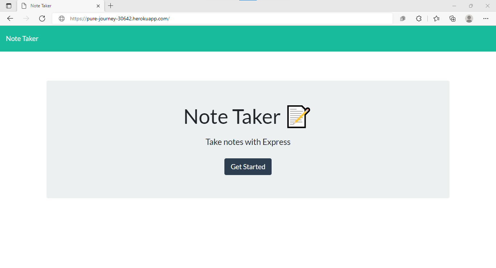
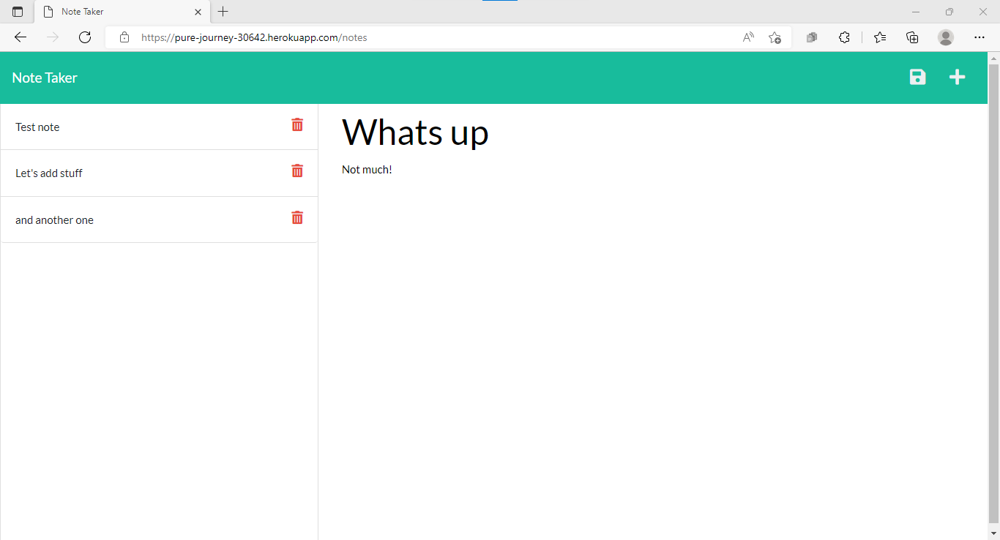

# Nickless Note Kiiper

## Description

Our application is a full-fledge note keeper! Our task was to connect the front-end to our newly developed back-up, supported by Express.js. The features implemented on this app include:

- Add new notes
- Open existing notes for viewing
- Delete existing notes once they become obsolete

## Installation

In order to use this project, make sure to sure 'npm install' to obtain the appropriate npm modules that allow for the execution of the application. Please also make sure to read this entire README.md file for all additional information.

## Usage

To start the execution of the application local, type 'node server' which will set your server to listen on port 3001. At this point, navigate to

```
http://localhost:3001/
```

to start using the application. Alternatively, the application has also been deployed using Heroku, on

```
https://pure-journey-30642.herokuapp.com/ 
```

Screenshots of the application are shown below:





## Contribute

To contribute to this project, please fork it from the GitHub repository and when the pull request is sent, our team will work on merging the changes as needed/appropriate.

GitHub Repository Link: https://github.com/nickless192/nickless-notekiiper

## Testing

At the moment, no testing is set up for this project. Please visit us soon for more updates on testing.


## License

This project is covered under the MIT license agreement.

## Questions

Find my GitHub profile at https://github.com/nickless192 or email me at nickless@nickless.com.

## Contributors

Made with ❤️ by Nickless192 (Omar Rodriguez)